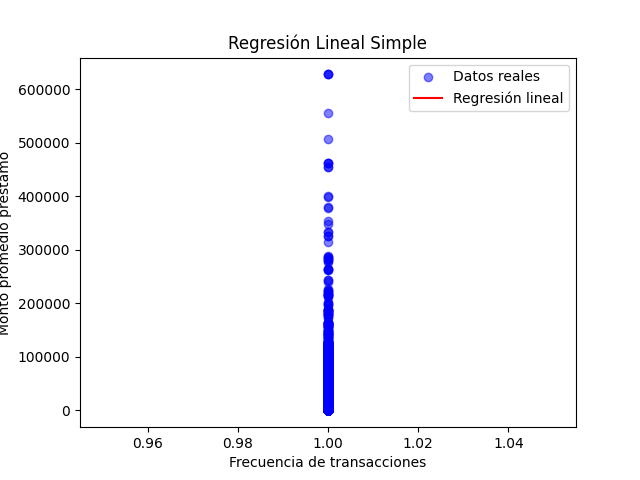
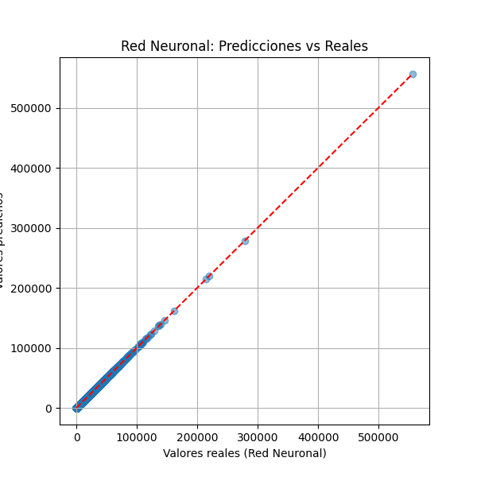

# Predicción de Préstamos con Modelos de Machine Learning

## 🎯 Objetivo

Desarrollar modelos predictivos (regresión lineal y red neuronal) para estimar el monto promedio de préstamos utilizando datos históricos de transacciones.

---

## 📊 Descripción del Dataset

El dataset `dataBasePrestDigital.csv` contiene información de clientes, como:
- Edad (`rngEdad`)
- Monto promedio de préstamos en los últimos 3 meses (`promSaldoPrest3Um`)
- Cliente (`cliente`)
- Tipo de transacción
- Ubicación, entre otros.

---

## 📚 Librerías utilizadas

- `pandas`
- `numpy`
- `matplotlib`
- `seaborn`
- `sklearn`
- `tensorflow` (Keras)

---

## 🤖 Modelos utilizados

### 1. Regresión Lineal

- Se utilizaron variables como `frecuencia_transacciones` y `promSaldoPrest3Um`.
- Se graficó la línea de mejor ajuste y se evaluó el error cuadrático medio.

---

### 2. Red Neuronal

- Arquitectura con dos capas ocultas (`relu`) y una capa de salida.
- Entrenada durante 50 épocas.
- Se evaluó con métricas `mse` y `mae`.

---

## 🧠 Lógica de programación usada

Se aplicaron estructuras como:

- `for` para analizar múltiples resultados
- `if` para condiciones en los datos
- Listas y diccionarios para organizar salidas gráficas y métricas.

---

## 📝 Conclusiones personales

- La regresión lineal ofrece resultados rápidos, pero limitados.
- La red neuronal mejora la predicción con mayor complejidad.
- Es clave filtrar y limpiar bien los datos para obtener modelos más fiables.
